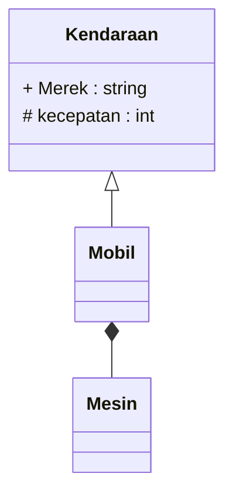
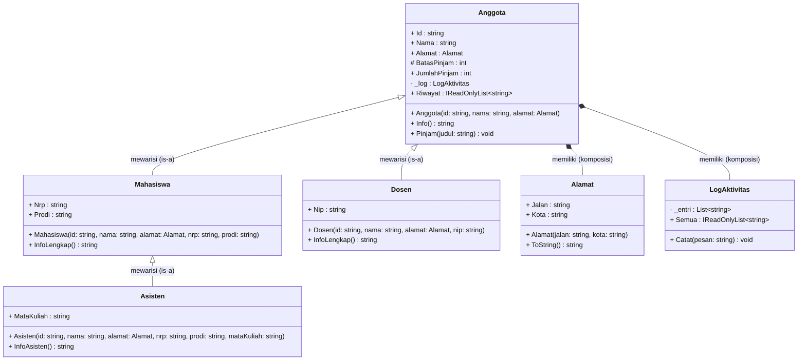

# Diagram Hierarki Kelas (UML) — Perpustakaan

Gambarkan diagram UML yang menunjukkan **hubungan antar kelas** di pertemuan ini, di bagian **bawah** penanda di akhir berkas ini. Format bebas — boleh kotak ASCII/Mermaid (`classDiagram`) atau daftar bertingkat. Yang wajib ada:

- Kelas `Anggota`, `Mahasiswa`, `Dosen`, `Asisten`, `Alamat`, dan `LogAktivitas`.
- Hubungan **pewarisan** (*is-a*): panah segitiga kosong dari kelas turunan ke kelas induk (`<|--` di Mermaid, atau `▲`, atau tulis "extends"/"turunan dari").
- Hubungan **komposisi** (*has-a*): berlian terisi dekat pihak pemilik (`*--` di Mermaid, atau `◆`, atau tulis "komposisi"/"memiliki") — siapa memiliki siapa?
- Anggota `protected` ditandai dengan simbol `#` (mis. `# BatasPinjam`), `public` dengan `+`, `private` dengan `-`.

Contoh format Mermaid (untuk kelas lain, bukan jawaban):

Jangan hapus baris penanda di bawah ini — jawaban kalian harus ditulis **setelah** baris itu, bukan sebelumnya.

<!-- TULIS JAWABAN KALIAN DI BAWAH BARIS INI -->

### Penjelasan Hubungan Antar Kelas

1. **Hubungan Pewarisan (*is-a* / Inheritance)**:
   - Simbol panah segitiga kosong (`<|--`): Menunjukkan kelas turunan mewarisi atribut dan perilaku dari kelas induk.
   - `Mahasiswa` adalah turunan dari (`extends` / mewarisi) `Anggota`.
   - `Dosen` adalah turunan dari (`extends` / mewarisi) `Anggota`.
   - `Asisten` adalah turunan bertingkat dari (`extends` / mewarisi) `Mahasiswa` (sehingga `Asisten` secara transitif juga *is-a* `Anggota`). Kelas ini bersifat `sealed`.

2. **Hubungan Komposisi (*has-a* / Composition)**:
   - Simbol wajik terisi (`*--`): Menunjukkan kepemilikan kuat (komposisi), di mana masa hidup objek komponen bergantung pada objek pemilik.
   - `Anggota` memiliki objek `Alamat` (`Anggota *-- Alamat`).
   - `Anggota` memiliki objek `LogAktivitas` secara privat dan independen per instance (`Anggota *-- LogAktivitas`).

3. **Simbol Visibilitas Anggota Kelas**:
   - `+` menandakan akses **`public`** (dapat diakses dari luar kelas).
   - `#` menandakan akses **`protected`** (dapat diakses oleh kelas itu sendiri dan kelas-kelas turunannya, seperti `# BatasPinjam`).
   - `-` menandakan akses **`private`** (hanya dapat diakses di dalam kelas yang mendefinisikannya, seperti field `_log` dan `_entri`).

