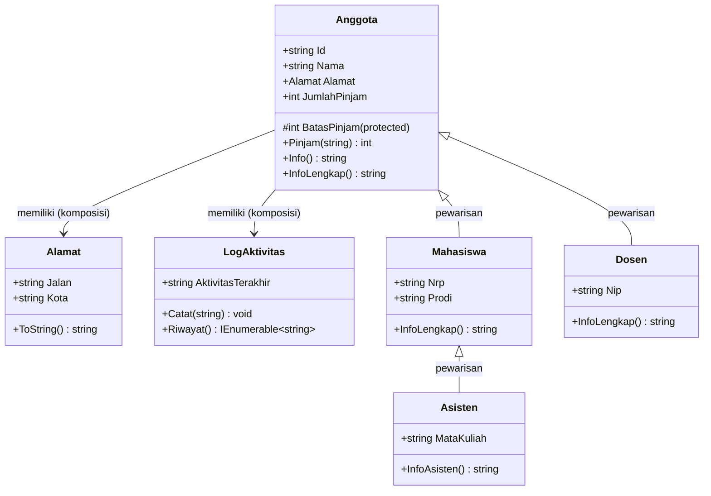

<!-- TULIS JAWABAN KALIAN DI BAWAH BARIS INI -->

```mermaid
classDiagram
    class Alamat {
        +string Jalan
        +string Kota
        +ToString() string
    }
    class LogAktivitas {
        +string AktivitasTerakhir
        +Catat(string) void
        +Riwayat() IEnumerable~string~
    }
    class Anggota {
        +string Id
        +string Nama
        +Alamat Alamat
        #int BatasPinjam (protected)
        +int JumlahPinjam
        +Pinjam(string) int
        +Info() string
        +InfoLengkap() string
    }
    class Mahasiswa {
        +string Nrp
        +string Prodi
        +InfoLengkap() string
    }
    class Dosen {
        +string Nip
        +InfoLengkap() string
    }
    class Asisten {
        +string MataKuliah
        +InfoAsisten() string
    }

    Anggota --> Alamat : memiliki (komposisi)
    Anggota --> LogAktivitas : memiliki (komposisi)
    Anggota <|-- Mahasiswa : pewarisan
    Anggota <|-- Dosen : pewarisan
    Mahasiswa <|-- Asisten : pewarisan
```
